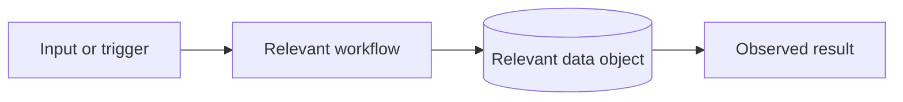

# Ticket context

Create a concise, evidence-backed Markdown brief that helps someone unfamiliar
with the business understand a ticket before implementation. Use connected
business sources such as Jira, Confluence, issue trackers, wikis, roadmaps,
or linked documents when access is available, then use repository documentation, schema
or migrations, configuration, relevant code, tests, and recent history as
implementation evidence. Do not implement application changes, modify a
business record, or invent meaning that the available sources do not support.

## Workflow

1. Identify the ticket and its intended outcome. Accept a ticket file, pasted
   ticket, issue body, chat description, or business-system issue key/URL. If
   the target is ambiguous, state the assumption in the brief and continue
   with the smallest useful scope.
2. If a connected business source is available, inspect the ticket and
   relevant linked context. This includes Jira issues and their parent or child
   issues, dependencies, comments, acceptance criteria, labels, and
   components, plus Confluence pages, spaces, linked designs, decisions, and
   referenced policy or domain documents. Prefer read-only access. If access
   is unavailable or fails, record that limitation and use the supplied ticket
   content plus repository evidence; never imply external context was checked.
3. Define the scope boundary: the ticket's nouns, verbs, entry points, and
   acceptance criteria. Search for those terms and likely synonyms across the
   business sources and repository before choosing relevant code or data.
4. Trace the smallest end-to-end slice that explains the ticket: user or
   external input, command/API/job entry point, service or workflow, data
   access, persistence, and observable output. Include tests and migrations
   when they clarify behavior or constraints.
5. Explain domain objects and relationships at a useful level. Cover tables,
   models, views, queues, events, or external systems only when they affect
   the ticket. Record keys, ownership, lifecycle/status fields, important
   constraints, and cardinality when supported by evidence.
6. Distinguish facts from interpretation. Link or name external sources using
   issue keys or direct links, and repository evidence using relative Markdown
   links with line numbers when useful.
   Mark gaps as `Unknown`, `Assumption`, or `Needs confirmation`; never fill a
   business gap with a confident guess.
7. Write the context brief to the requested Markdown path. If no path is
   given, use `docs/ticket-context/<date>-<ticket-slug>.md`, creating the
   directory if needed. Preserve existing user changes and avoid overwriting
   an existing brief without explicit direction.

## Required output

Keep sections short and tailored to the ticket. Omit a section only when it is
 genuinely irrelevant, and say so when omitting it would otherwise be
 surprising.

```markdown
# Ticket context: <title>

> Status: context brief | Evidence scope: <business sources, paths, ticket, and date inspected>

## Business context

| Source | Relevant information | Confidence / limitation |
| --- | --- | --- |
| <Jira or issue key/link> | <intent, decision, dependency, or acceptance criterion> | Confirmed / stale / access unavailable |
| <wiki, design, or policy link> | <business rule or terminology> | Confirmed / inferred / needs confirmation |

## At a glance

<A few sentences: what the ticket changes, why it matters, and the main path to
understand first.>

## Ticket boundary

| In scope | Out of scope or not established |
| --- | --- |
| ... | ... |

## Domain and data objects

| Object | What it represents | Key fields / states | Relationship to this ticket | Evidence |
| --- | --- | --- | --- | --- |
| ... | ... | ... | ... | ... |

## Relationships



<Use an ER-style diagram for table relationships, or a flowchart for runtime
behavior. Keep labels short and show only relationships supported by evidence.>

## Code path

| Stage | Location | Responsibility | Why it matters |
| --- | --- | --- | --- |
| Entry point | `path/to/file:line` | ... | ... |
| ... | ... | ... | ... |

## Terminology and business rules

| Term | Meaning in this repository | Evidence / confidence |
| --- | --- | --- |
| ... | ... | Confirmed / inferred / unknown |

## Ticket-to-system map

| Ticket statement or acceptance criterion | Code/data area | Current behavior | Likely change surface or investigation |
| --- | --- | --- | --- |
| ... | ... | ... | ... |

## Questions, risks, and next checks

- **Unknown:** ...
- **Assumption:** ...
- **Needs confirmation:** ...
- **Risk or edge case:** ...
- **Suggested next check:** ...

## Reading order

1. `path/to/most-useful-file:line` — <reason>
2. ...
```

Use tables for repeated comparisons and Mermaid only when it clarifies a
relationship or sequence. Prefer one small diagram over several decorative
ones. A brief may include SQL or pseudocode to explain a query or transition,
but do not present unverified SQL as a production change.

## Evidence and scope rules

- Prefer definitions in models, migrations, schema files, contracts, and
  tests over names or comments alone.
- Prefer connected business sources for intent, priority, ownership,
  acceptance criteria, and business terminology; prefer current code, schema,
  and tests for how the system behaves today. When they differ, show both and
  flag the conflict.
- Record the source and date for claims that may go stale, such as status,
  ownership, rollout plans, or linked decisions. Summarize issue histories and
  comments instead of copying them wholesale.
- Follow foreign keys, identifiers, status transitions, serializers, and
  callers far enough to explain ownership and lifecycle; stop when the path
  becomes unrelated infrastructure.
- Include historical evidence only when it explains a current constraint or
  naming choice. Do not turn the brief into a commit-history report.
- Explain acronyms and business terms for a new joiner, but keep the brief
  focused on this ticket rather than documenting the whole product.
- Call out contradictions between ticket text, code, schema, and tests. State
  which source appears authoritative and why, without silently resolving the
  contradiction.
- Do not make changes in Jira or other business systems while gathering
  context. Reading and citing information is in scope; editing, commenting,
  transitioning, or assigning a business record requires a separate explicit
  request.
- Do not include secrets, credentials, personal data, or large raw data
  extracts. Summarize representative values and point to safe fixtures or
  schema definitions instead.

When the brief is complete, report its path, the evidence inspected, and any
important unresolved questions. Do not claim that the ticket is ready to
implement unless the evidence supports that conclusion; this skill produces
context, not an implementation plan.

For implementation planning after the context is understood, use
[ticket-to-plan](../ticket-to-plan/SKILL.md).
